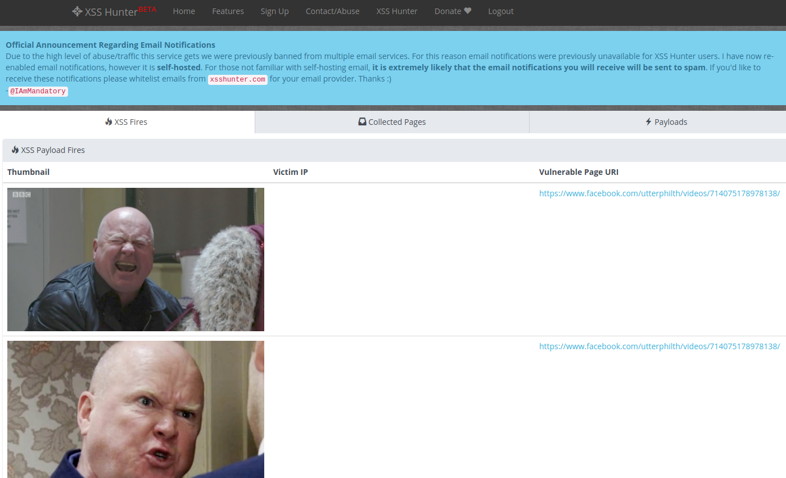

# Phil Mitchell XSSHunter Delivery Service

## Description

Sick of finding other people's [XSSHunter](https://xsshunter.com) payloads when you are searching for bug bounty gold?

Spam their XSSHunter instance fake reports full of Phil Mitchell pictures.

## Screenshot 



## Usage

```
$ python main.py -h 
  ______           _  __   __ _____  _____           _               
 |  ____|         | | \ \ / // ____|/ ____|         | |              
 | |__    __ _ ___| |_ \ V /| (___ | (___  _ __   __| | ___ _ __ ___
 |  __|  / _` / __| __| > <  \___ \ \___ \| '_ \ / _` |/ _ \ '__/ __|
 | |____| (_| \__ \ |_ / . \ ____) |____) | | | | (_| |  __/ |  \__ \
 |______|\__,_|___/\__/_/ \_\_____/|_____/|_| |_|\__,_|\___|_|  |___/

usage: main.py [-h] hostname

Spam pictures of Phil Mitchell and fake reports to XSSHunter collector
instances.

positional arguments:
  hostname         Target XSSHunter collector hostname. e.g example.xss.ht
```

```
$ python main.py philmitchell.xss.ht
  ______           _  __   __ _____  _____           _               
 |  ____|         | | \ \ / // ____|/ ____|         | |              
 | |__    __ _ ___| |_ \ V /| (___ | (___  _ __   __| | ___ _ __ ___
 |  __|  / _` / __| __| > <  \___ \ \___ \| '_ \ / _` |/ _ \ '__/ __|
 | |____| (_| \__ \ |_ / . \ ____) |____) | | | | (_| |  __/ |  \__ \
 |______|\__,_|___/\__/_/ \_\_____/|_____/|_| |_|\__,_|\___|_|  |___/

Sending 10 Phils to https://phillmitchell.xss.ht
Phil Mitchell has been sent
Phil Mitchell has been sent
Phil Mitchell has been sent
Phil Mitchell has been sent
Phil Mitchell has been sent
Phil Mitchell has been sent
Phil Mitchell has been sent
Phil Mitchell has been sent
Phil Mitchell has been sent
Phil Mitchell has been sent
Done
```


## FAQ

**Who is Phil Mitchell?**  


**That didn't explain anything, who is Phil Mitchell?**  
[https://www.facebook.com/utterphilth/videos/714075178978138/](https://www.facebook.com/utterphilth/videos/714075178978138/)

**Do you not like XSSHunter?**  
I actually **like** [XSSHunter](https://xsshunter.com), it's a useful tool for discovering blind XSS.

## Credits 

[UtterPhilth](https://www.facebook.com/utterphilth/) for producing the finest Phil Mitchell content  
[XSSHunter](https://xsshunter.com) and @IAmMandatory for developing it
